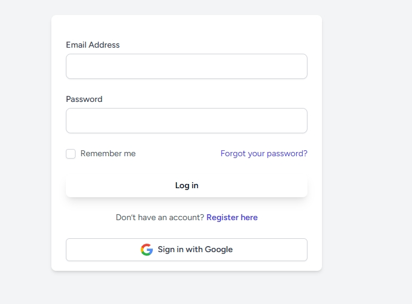

# Food_ordering_system

# 📸 Overview

Screenshots of the Food Ordering System overview.

---

## 📌 Screenshot 1


---

## 📌 Screenshot 2


---

## 📌 Screenshot 3


---

## 📌 Screenshot 4


---

## 📌 Screenshot 5


---

## 📌 Screenshot 6


---

## 📌 Screenshot 7


---

## 📌 Screenshot 8


---

## 📌 Screenshot 9


<p align="center">
  <a href="https://laravel.com" target="_blank">
    
  </a>
</p>

<p align="center">
  <a href="https://github.com/laravel/framework/actions"></a>
  <a href="https://packagist.org/packages/laravel/framework"></a>
  <a href="https://packagist.org/packages/laravel/framework"></a>
  <a href="https://packagist.org/packages/laravel/framework"></a>
</p>

---

# 🍽️ Food Ordering System

## Description 

The Food Ordering System is a web-based platform that allows users to order food online from restaurants. It provides separate roles for Admin and Customers. The system supports multiple payment methods and integrates Google Maps for location services.

---

## 🔥 Features 

### 🛠️ Admin Panel: 
- Manage restaurants, food items, and orders  
- View user profiles and order history  
- Process payments and manage order status  

### 👨‍🍳 Customer Panel: 
- Browse restaurants and food menus  
- Add items to the cart and place orders  
- Track order status in real-time  
- Secure payments via Stripe, bKash, or Cash on Delivery  

---

## 💻 Technologies Used 

- **Backend**: PHP (Laravel Framework)  
- **Frontend**: HTML, Tailwind CSS  
- **Database**: MySQL  
- **Payment Integration**: Stripe, bKash, Cash on Delivery  
- **Location Services**: Google Maps API  

---
## 🌐 Usage
- Access the app at http://127.0.0.1:8000

- Register as a customer to place orders

- Log in as an admin to manage the system
- 
## ⚙️ Installation 

### ✅ Prerequisites 
- PHP 8.x  
- Composer  
- Node.js & npm  
- MySQL (XAMPP recommended)  

### 🚀 Setup Steps 

1. **Clone the repository**  
   ```bash
   git clone https://github.com/yourusername/food-ordering-system.git
   cd food-ordering-system
